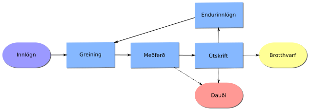

### Ágrip
Óskað var eftir sögulegum gögnum um bráðar endurinnlagnir á legudeildir geðsviðs Landspítalans. Gagnasettið sem var afhent var í löngu sniði með 20013 athugunum og 17 breytum. Þegar fjöldi sjúklinga var skoðaður voru þeir 7023. Af þessum 7023 voru 3765 með engar endurkomur. Rannsóknartímabilið eru innlagnir á árunum 2007 - 2017. Þar sem sami einstaklingur gat verið lagður inn ítrekað á tímabilinu er rannsóknin afturvirk langsniðsrannsókn með paraðar mælingar. Atburðurinn sem skal rannsaka er endurinnlögn.

Ferlið sem einstaklingur fer í gegnum á rannsóknartímabilinu má sjá á eftirfarandi mynd:

1. **Innlögn**: Innlögn er skilgreind sem fyrsti atburður sjúklings í rannsókninni. Þessi skilgreining er takmörkuð að því leyti að hún lítur framhjá sögu sjúklings fyrir rannsóknartímabilið. 

2. **Greining**: Greining sjúklings er ein höfuðskýrabreyta rannsóknarinnar. Sambönd sem vert er að skoða eru: 
    * Hvert er samband tíðni endurinnlagna og greiningar? 
    * Hvert er samband greiningar og meðferðarlengdar á legudeild?
    * Hvert er samband greiningar og tíma til endurinnlagnar?
  
    Þessi listi er ekki tæmandi.

3. **Meðferð**: Dvalartími er skilgreindur sem lengd meðferðar. Það er, fjöldi daga frá (endur)innlögn til útskriftar. Dvalartími sjúklings getur endurspeglað alvarleika sjúkdóms og haft eitthvert spágildi um endurinnlögn sjúklings. Láti einstaklingur lífið á meðan meðferð stendur yfir er það skráð og því hægt að taka tillit til þess við gerð líkana.

4. **Útskrift**: Útskrift sjúklings er vendipunktur atburðaferils hans. Möguleg afdrif sjúklings er þrenn:
    * Sjúklingur leggst aftur inn á legudeild eftir ákveðinn tíma. Þessi tími er nefndur tími til endurinnlagnar og er skilgreindur sem fjöldi daga frá útskrift til endurinnlagnar.
    * Sjúklingur leggst ekki aftur inn á geðdeild sökum brotthvarfs úr rannsókninni. Ástæður fyrir brotthvarfi eru ýmsar. Til dæmis, þá gæti sjúklingur verið fluttur af landi eða álitið sig hafa næg tök á sjúkdómi sínum. Það er hægt að líta á tíma til endurinnlagnar ásamt dvalartíma sem mælikvarða á áhrifamætti meðferðar. Þetta er þó varasamt þegar tekið er tillit til dauða.
    * Sjúklingur leggst ekki aftur inn á geðdeild sökum dauða. Þar sem rannsakendur hafa ekki gögn um dauða sjúklinga þegar slíkur atburður á sér stað utan spítalans getur hann bjagað spágetu líkana.
    
Til að bera kennsl á þá áhættuþætti sem auka líkur á endurinnlögn þarf því að hafa eftirfarandi spurningar í huga:

1. Hver er dreifing atburða (endurinnlögn)?
2. Hver eru áhrif tilteknar sjúkdómsgreiningar á dvalartíma, tíma milli endurinnlagnar og tíðni endurinnlagna?
3. Hverjar eru dreifingar dvalartíma og tíma til endurinnlagnar?
4. Eru dvalartímar einstaklings óháðir og einsdreifðir?
5. Eru tímabili utan geðdeild óháð og einsdreifð?
6. Er dvalartími og tími til endurinnlagnar ferli sem eru óháð hvor öðru?
7. Eru ferli einstaklinga með sömu greiningar einsleit eða misleit?

Mörg líkön eru til sem hafa verið þróuð með slíkar spurningar í huga. Má þar nefna Kaplan-Meier, Cox (með og án slembiþátta), Markovkeðjur og slembiskóga.

### Líkön
Stutt umræða um líkön
